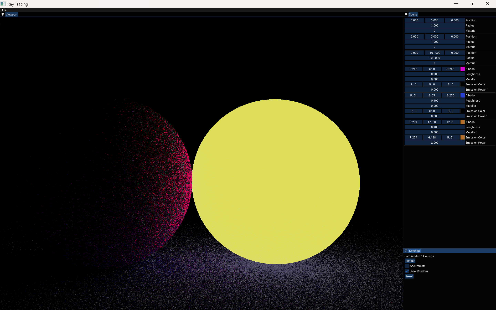
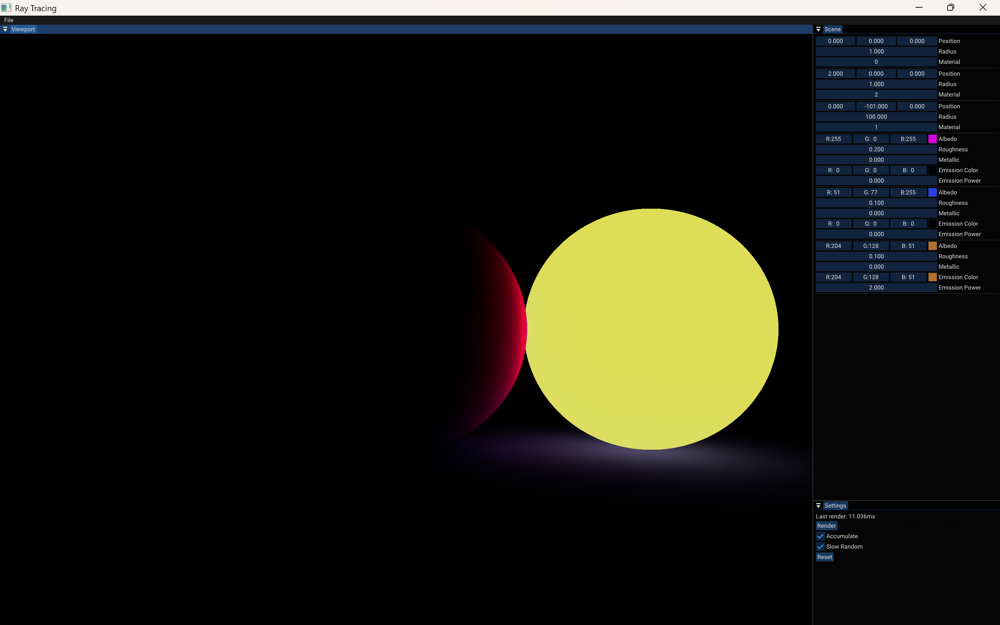

# Ray Tracing — NVIDIA GPU Accelerated Path Tracer

[English](/README.md) | [中文](/docs/README_zh-CN.md)


## Description

A real-time interactive path tracer built with C++23 and the Walnut application framework. **GPU-accelerated via NVIDIA CUDA** — the entire path tracing pipeline (ray generation, intersection, shading, accumulation) runs on the GPU. Falls back to CPU multi-threaded rendering when CUDA is not available.

### Architecture

| Component | Multi-Threaded CPU | GPU (CUDA) |
|-----------|---------------------|------------------------|
| Ray Generation | `std::execution::par` across CPU threads | CUDA kernel — one thread per pixel |
| Ray-Sphere Intersection | Brute-force loop (CPU) | `__device__` function (GPU) |
| Path Tracing (5 bounces) | CPU scalar loop | GPU SIMT parallelism |
| Random Number Generation | PCG Hash (CPU) | PCG Hash (GPU `__device__`) |
| Accumulation Buffer | Host `glm::vec4[]` | Device `float4[]` |
| Display | Walnut::Image (Vulkan) | Walnut::Image (Vulkan) via D2H copy |
| Russian Roulette | CPU | GPU |

**GPU Kernel Layout**: 16×16 thread blocks, each pixel gets one CUDA thread. The `RenderKernel` performs full path tracing per pixel including ray-sphere intersection, Russian roulette termination, Lambertian diffuse BRDF sampling, and progressive accumulation.

## Requirements

- **NVIDIA GPU** (optional) with Compute Capability ≥ 7.5 (Turing / Ampere / Ada / Blackwell)
  - sm_75: GTX 16xx, RTX 20xx
  - sm_86: RTX 30xx
  - sm_89: RTX 40xx
  - sm_120: RTX 50xx
- **CUDA Toolkit 12.0+** (optional, 13.x recommended for GPU acceleration)
- **Vulkan SDK 1.4+**
- **Visual Studio 2026** (or 2022, backward compatible) with C++23 support

## How To Build

### 1. Clone the Repository
```bash
git clone --recursive https://github.com/Cle2ment/RayTracing.git
cd RayTracing
```

### 2. Install Dependencies
- **[CUDA Toolkit](https://developer.nvidia.com/cuda-downloads)** — Required for GPU rendering. Set `CUDA_PATH` environment variable automatically by the installer.
- **[Vulkan SDK](https://vulkan.lunarg.com/)** — Required for display. Install to default location.

### 3. Generate Project Files
```bash
cd scripts
Setup.bat
```
This runs **Premake5 5.0.0-beta8** to generate Visual Studio 2026 solution files. The script automatically downloads premake5 if not present (the version bundled with Walnut does not support `cppdialect "C++23"`). The build system automatically detects CUDA and enables GPU acceleration.

### 4. Build & Run
Open `RayTracing.slnx` in Visual Studio 2026 and build (Release or Dist mode recommended for performance).

### Build Without CUDA
If CUDA Toolkit is not installed, the project builds as a CPU-only path tracer using `std::execution::par`. The build system defines `WL_CUDA` only when CUDA is detected.

### ISPC Acceleration (Optional)
[ISPC](https://github.com/ispc/ispc) (Intel SPMD Program Compiler) provides SIMD acceleration for the CPU path tracer. The `Setup.bat` script automatically downloads ISPC v1.30.0 to `vendor/ispc/`. When detected, the build system defines `WL_ISPC` and enables AVX2+AVX-512 vectorized path tracing.

To install manually: download `ispc-v1.30.0-windows.zip` from the [ISPC releases page](https://github.com/ispc/ispc/releases/tag/v1.30.0) and extract its contents to `vendor/ispc/`.

## Rendering Pipeline

```
Camera (CPU)                    Scene (CPU)
    │                                │
    ├─ Ray Directions ─┐         ┌─── Spheres + Materials
    │                  │         │
    ▼                  ▼         ▼
┌─────────────────────────────────────────┐
│           CUDARenderer.cu               │
│                                         │
│  RenderKernel <<<grid, block>>>         │
│    └─ PerPixel(x, y)                    │
│         └─ for bounce in 0..5:          │
│              └─ TraceRay()              │
│                   └─ sphere loop (GPU)  │
│              └─ Russian Roulette        │
│              └─ Diffuse BRDF            │
│    └─ Accumulate + Tone Map             │
│    └─ Write RGBA8 output                │
└─────────────────────────────────────────┘
    │
    ▼ (cudaMemcpy D2H)
Walnut::Image (Vulkan) ──► Display
```

## File Structure

```
RayTracing/
├── src/
│   ├── WalnutApp.cpp          # Entry point, ImGui UI, scene setup
│   ├── Renderer.h/cpp         # Renderer class (CPU/GPU dispatch)
│   ├── Camera.h/cpp           # Camera (CPU), ray direction generation
│   ├── Ray.h                  # Ray struct (CPU)
│   ├── Scene.h                # Scene data (CPU spheres + materials)
│   ├── CUDATypes.cuh          # GPU data structures
│   ├── CUDARenderer.cuh       # GPU kernels + device functions
│   ├── CUDARenderer.cu        # CUDA host wrappers (C linkage)
│   └── CUDARenderer.h         # Host C++ interface + packing helpers
├── premake5.lua               # Build configuration (+ CUDA support)
├── .github/workflows/build.yml # CI/CD pipeline
└── README.md
```

## CI/CD

[](https://github.com/Cle2ment/RayTracing/actions/workflows/build.yml)

GitHub Actions builds on every push and pull request:
- **Windows Server 2025** with CUDA 13.3 + Vulkan SDK
- Debug and Release configurations
- Build artifacts available for download on Release builds

## Key Bindings

| Key | Action |
|-----|--------|
| Right Mouse + Drag | Rotate camera |
| W/A/S/D | Move camera |
| Q/E | Move down/up |
| Render button | Trigger re-render |
| Accumulate checkbox | Enable/disable progressive rendering |

## Demonstration

The Ray Tracing project is still under development.

Here is the current demonstration of the project.\



## About WalnutAppTemplate
- Description\
This is a simple app template for Walnut - unlike the example within the Walnut repository, this keeps Walnut as an external submodule and is much more sensible for actually building applications. See the Walnut repository for more details.
- Getting Started\
Once you've cloned, you can customize the `premake5.lua` and `WalnutApp/premake5.lua` files to your liking (eg. change the name from "WalnutApp" to something else). Once you're happy, run `scripts/Setup.bat` to generate Visual Studio 2022 solution/project files. Your app is located in the `WalnutApp/` directory, which some basic example code to get you going in `WalnutApp/src/WalnutApp.cpp`. I recommend modifying that WalnutApp project to create your own application, as everything should be setup and ready to go.

## Troubleshooting

| Symptom | Cause | Solution |
|---------|-------|---------|
| Viewport is black | CUDA architecture mismatch | Verify GPU model, check that `cudaArchs` in `premake5.lua` includes the correct `sm_XX` |
| `no kernel image is available` | nvcc did not compile for target GPU | Add corresponding `-gencode=arch=compute_XX,code=sm_XX` |
| `CUDA_PATH` not set | Environment variable missing | System Properties → Environment Variables → New `CUDA_PATH`, point to CUDA Toolkit directory |
| `.cu` files not compiled during build | `CUDA_PATH` not effective at generation time | Restart terminal, verify `echo %CUDA_PATH%` is non-empty, then re-run `Setup.bat` |
| Linker reports `CUDARenderer_*` undefined | `CUDARenderer.obj` not linked | Check `linkoptions { "$(IntDir)CUDARenderer.obj" }` in `premake5.lua` |
| `invalid value 'C++23' for cppdialect` | Using old premake5 bundled with Walnut | Run `scripts\Setup.bat` (auto-downloads newer version) or manually download premake5 5.0.0-beta8 |

## LICENSE
The project uses `MIT License`.

## Copyright
© Bonity, 2024
